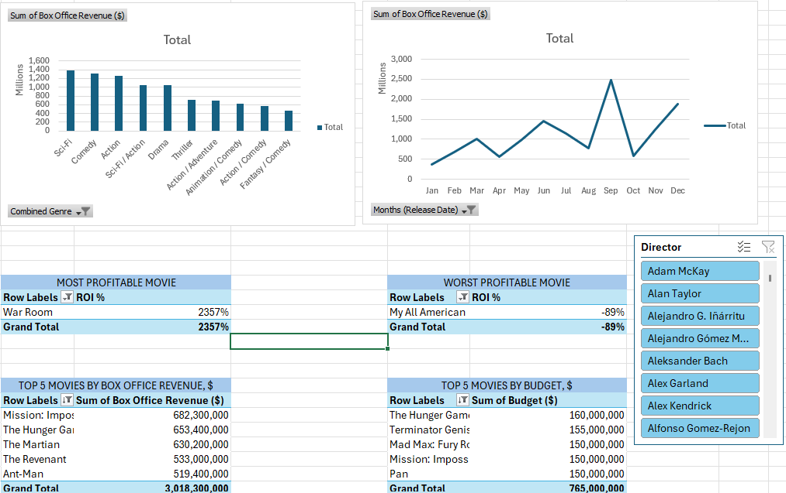

# Movie Data Analysis Dashboard


## Table of Content

 - [Project Overview](#project-overview)

 - [Data Sources](#data-sources)

 - [Findings](#results-and-findings)


### Project Overview

This data analysis project aims to provide insights into the performance and trends of movies from 2012 to 2016. 

By analyzing various aspects of the movie data, we seek to identify patterns, make data-driven recommendations, and gain a deeper understanding of the industry's dynamics.


### Data Sources

Movie Data: 

The primary dataset used for this analysis is the "Movie Data Homework.xmls" file, containing detailed information about each movie's performance, actors, directors etc.

[Download here](https://github.com/yuvalmas/Movie-Data-Analytics/blob/main/HW10.xlsx)


### Tools


 - Power Query - Data Cleaning Download here

 - Excel, Pivot Tables - Data Analysis, Creating reports and visualizations


### Data Cleaning/Preparation


In the initial data preparation phase, we performed the following tasks:

1. Data loading and inspection.

2. Handling errors, missing values.

3. Data cleaning and formatting.


### Exploratory Data Analysis


### Results and Findings




#### M Language 

One of interesting features I was working with was a specific code for Grouping in M language which enable me to Combine genres together for further analysis.

```

= Table.Group(#"Sorted Rows1", {"Movie Title"}, 

                                            {{"Combined Genre", each Text.Combine([Concat Genre], " / "), type text},

                                            {"AllData", each _, 

                                                        type table [Movie Title=nullable text, Release Date=nullable date, Wikipedia URL=nullable text, Concat Genre=nullable text, Director=nullable text, Actor First=nullable text, Actor Second=nullable text, Actor Third=nullable text, Actor Fourth=nullable text, Actor Fifth=nullable text, #"Budget ($)"=nullable number, #"Box Office Revenue ($)"=nullable number]}

                                            }

```
